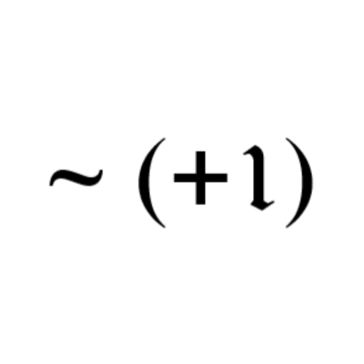

<p float="left">
<a href="../../"></a>
<a href="https://www.codacy.com/manual/FredHappyface/C.CodingChallenges"></a>
<a href="https://www.codacy.com/manual/FredHappyface/C.CodingChallenges"></a>
<a href="../../"></a>
<a href="../../issues"></a>
<a href="/LICENSE.md"></a>
<a href="../../commits/master"></a>
<a href="../../commits/master"></a>
</p>

# C.CodingChallenges

Multiple repositories combined containing simple c programs. Some coding
challenges to develop my knowledge and skills in go.

## Current programs
### factorial
The factorial method calculates the result of
n! For example 4! would be `4*3*2*1` = 24
### guessNumber
Generates a random number and gives the user 7 attempts
to guess it. If the user is successful, a "well done" message
is outputted and the program is terminated
### guessUserNumber
The main method takes a number between 1 and 100 from the user and
attempts to guess the number
### poundsToEuro


The main method prints set prices in GBP and Euros
### twosCompliment


This method takes a string representing a binary value
and returns an integer representation of the two's compliment
### writeToFile


The main method takes a user input and populates a text file called output.txt with integers from 1
to the number inputted by the user
### wordNumbers
Return a number as a word. For example, 2809 would be "two eight zero nine"

## TODO - Language

## Changelog
See the [CHANGELOG](/CHANGELOG.md) for more information.

## Download
### Clone
#### Using The Command Line
1. Press the Clone or download button in the top right
2. Copy the URL (link)
3. Open the command line and change directory to where you wish to
clone to
4. Type 'git clone' followed by URL in step 2
```bash
$ git clone https://github.com/FredHappyface/C.CodingChallenges
```

More information can be found at
<https://help.github.com/en/articles/cloning-a-repository>

#### Using GitHub Desktop
1. Press the Clone or download button in the top right
2. Click open in desktop
3. Choose the path for where you want and click Clone

More information can be found at
<https://help.github.com/en/desktop/contributing-to-projects/cloning-a-repository-from-github-to-github-desktop>

### Download Zip File

1. Download this GitHub repository
2. Extract the zip archive
3. Copy/ move to the desired location

## Licence
MIT License
Copyright (c) FredHappyface
(See the [LICENSE](/LICENSE.md) for more information.)
